ML Pipeline: Predicting Heart Disease
================
Paul Johnson
1/12/23

# Setup

``` r
# import packages
suppressPackageStartupMessages({
  library(dplyr)
  library(ggplot2)
  library(tidymodels)
})

# import packages required for models
library(xgboost)

theme_set(theme_minimal())

set.seed(456)

doParallel::registerDoParallel(cores=4)
```

# Data

``` r
heartdisease_raw <- MLDataR::heartdisease %>%
  janitor::clean_names()

glimpse(heartdisease_raw)
```

    Rows: 918
    Columns: 10
    $ age                <dbl> 40, 49, 37, 48, 54, 39, 45, 54, 37, 48, 37, 58, 39,…
    $ sex                <chr> "M", "F", "M", "F", "M", "M", "F", "M", "M", "F", "…
    $ resting_bp         <dbl> 140, 160, 130, 138, 150, 120, 130, 110, 140, 120, 1…
    $ cholesterol        <dbl> 289, 180, 283, 214, 195, 339, 237, 208, 207, 284, 2…
    $ fasting_bs         <dbl> 0, 0, 0, 0, 0, 0, 0, 0, 0, 0, 0, 0, 0, 0, 0, 0, 0, …
    $ resting_ecg        <chr> "Normal", "Normal", "ST", "Normal", "Normal", "Norm…
    $ max_hr             <dbl> 172, 156, 98, 108, 122, 170, 170, 142, 130, 120, 14…
    $ angina             <chr> "N", "N", "N", "Y", "N", "N", "N", "N", "Y", "N", "…
    $ heart_peak_reading <dbl> 0.0, 1.0, 0.0, 1.5, 0.0, 0.0, 0.0, 0.0, 1.5, 0.0, 0…
    $ heart_disease      <dbl> 0, 1, 0, 1, 0, 0, 0, 0, 1, 0, 0, 1, 0, 1, 0, 0, 1, …

``` r
heartdisease_raw <-
  heartdisease_raw %>%
  mutate(
    sex = as.factor(sex),
    fasting_bs = as.factor(fasting_bs),
    resting_ecg = as.factor(resting_ecg),
    angina = as.factor(angina),
    heart_disease = as.factor(heart_disease)
    #   #Create categories
    #   age_group = dplyr::case_when(
    #     age <= 45            ~ "28-45",
    #     age > 45 & age <= 59 ~ "46-59",
    #     age > 59             ~ "60+"
    #   ),
    #   # Convert to factor
    #   age_group = factor(
    #     age_group,
    #     level = c("28-45","46-59", "60+"))
  )

train_test_split <-
  rsample::initial_split(heartdisease_raw,
                         strata = heart_disease,
                         prop = 0.7)

train_df <- rsample::training(train_test_split)
test_df <- rsample::testing(train_test_split)

train_folds <- vfold_cv(train_df, strata = heart_disease)
train_folds
```

    #  10-fold cross-validation using stratification 
    # A tibble: 10 × 2
       splits           id    
       <list>           <chr> 
     1 <split [577/65]> Fold01
     2 <split [577/65]> Fold02
     3 <split [577/65]> Fold03
     4 <split [577/65]> Fold04
     5 <split [577/65]> Fold05
     6 <split [578/64]> Fold06
     7 <split [578/64]> Fold07
     8 <split [579/63]> Fold08
     9 <split [579/63]> Fold09
    10 <split [579/63]> Fold10

# Feature Exploration

``` r
# heart disease
train_df %>%
  count(heart_disease)
```

    # A tibble: 2 × 2
      heart_disease     n
      <fct>         <int>
    1 0               287
    2 1               355

``` r
# age
train_df %>%
  ggplot(aes(age, fill = heart_disease)) +
  geom_histogram(binwidth = 5, position = "dodge")
```

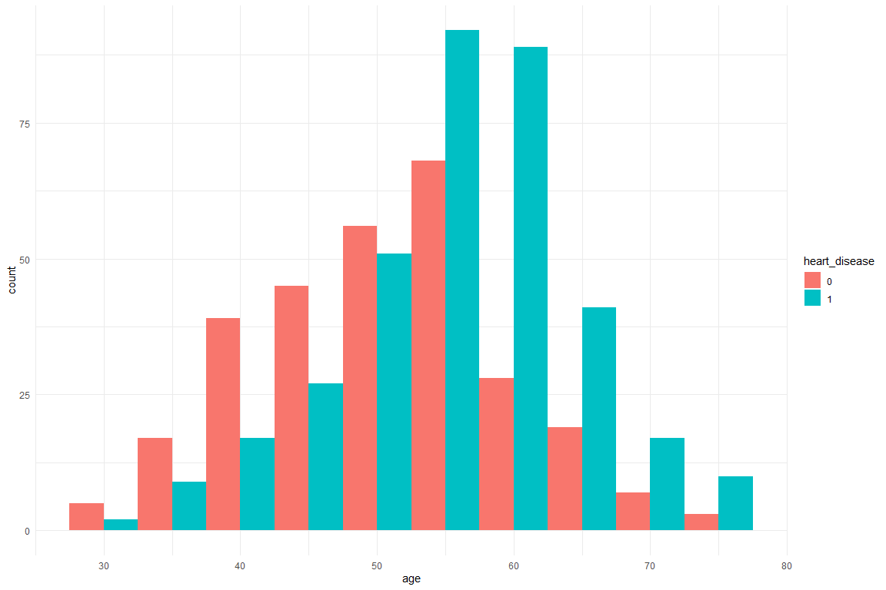

``` r
train_df %>%
  ggplot(aes(sex, fill = heart_disease)) +
  geom_bar(position = "dodge")
```

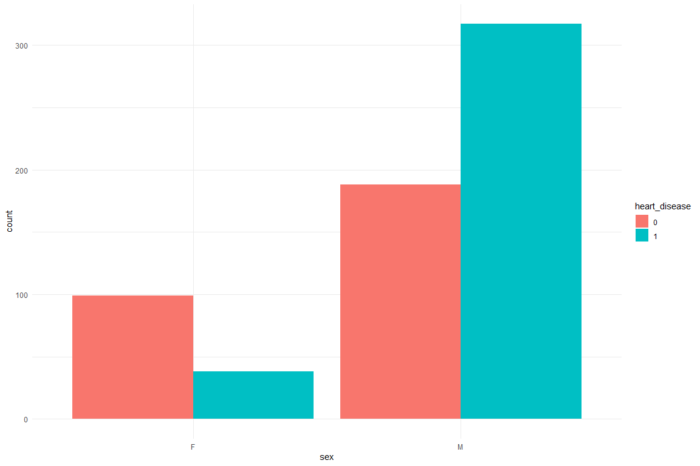

``` r
# resting ecg
train_df %>%
  count(resting_ecg)
```

    # A tibble: 3 × 2
      resting_ecg     n
      <fct>       <int>
    1 LVH           128
    2 Normal        383
    3 ST            131

``` r
train_df %>%
  ggplot(aes(resting_ecg, fill = heart_disease)) +
  geom_bar(position = "dodge")
```

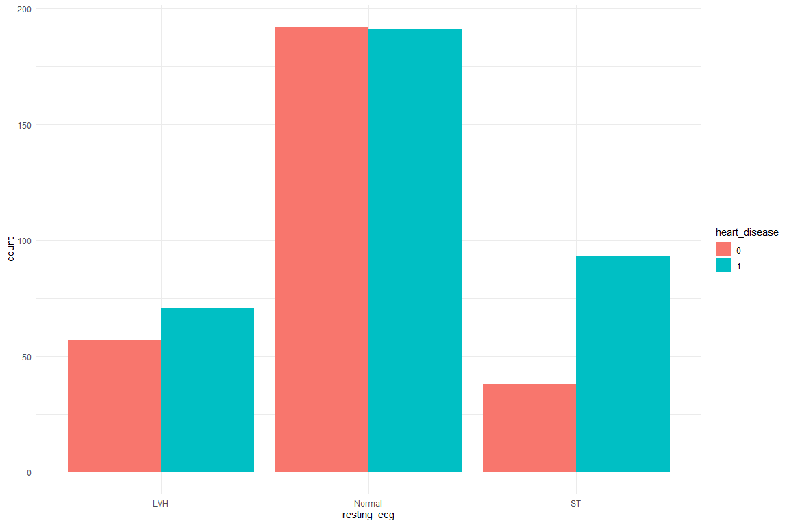

``` r
train_df %>% 
  group_by(resting_ecg) %>% 
  count(heart_disease) %>% 
  mutate(freq = n/sum(n))
```

    # A tibble: 6 × 4
    # Groups:   resting_ecg [3]
      resting_ecg heart_disease     n  freq
      <fct>       <fct>         <int> <dbl>
    1 LVH         0                57 0.445
    2 LVH         1                71 0.555
    3 Normal      0               192 0.501
    4 Normal      1               191 0.499
    5 ST          0                38 0.290
    6 ST          1                93 0.710

``` r
# max hr
train_df %>%
  ggplot(aes(max_hr, fill = heart_disease)) +
  geom_histogram(position = "dodge")
```

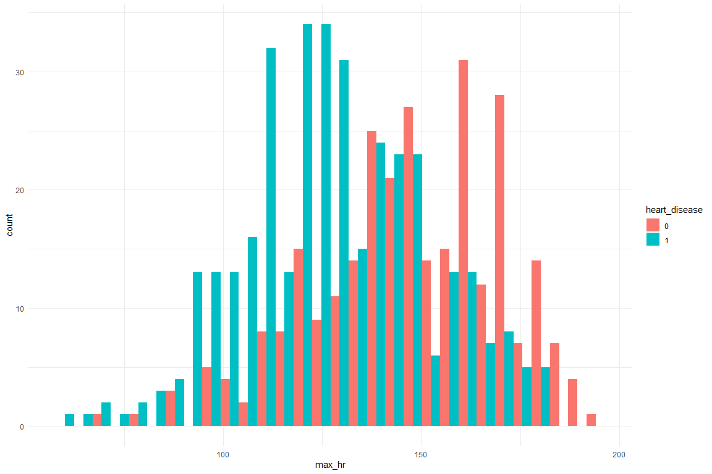

``` r
train_df %>%
  ggplot(aes(max_hr, fill = heart_disease)) +
  geom_histogram(position = "dodge")
```


``` r
# heart peak reading
train_df %>%
  ggplot(aes(heart_peak_reading)) +
  geom_histogram()
```

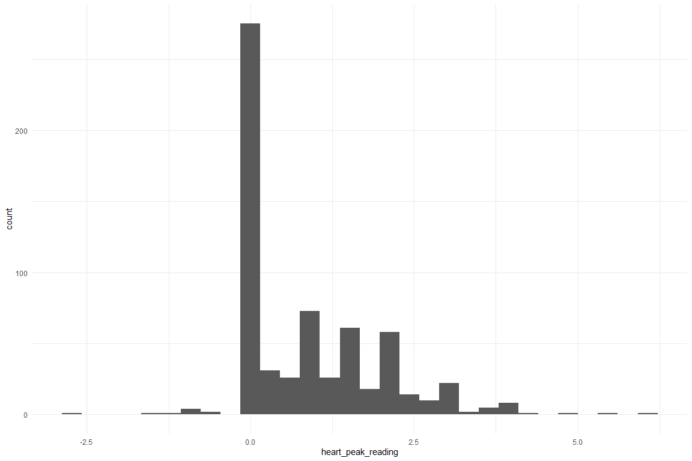

``` r
train_df %>%
  ggplot(aes(heart_peak_reading, fill = heart_disease)) +
  geom_histogram(position = "dodge")
```

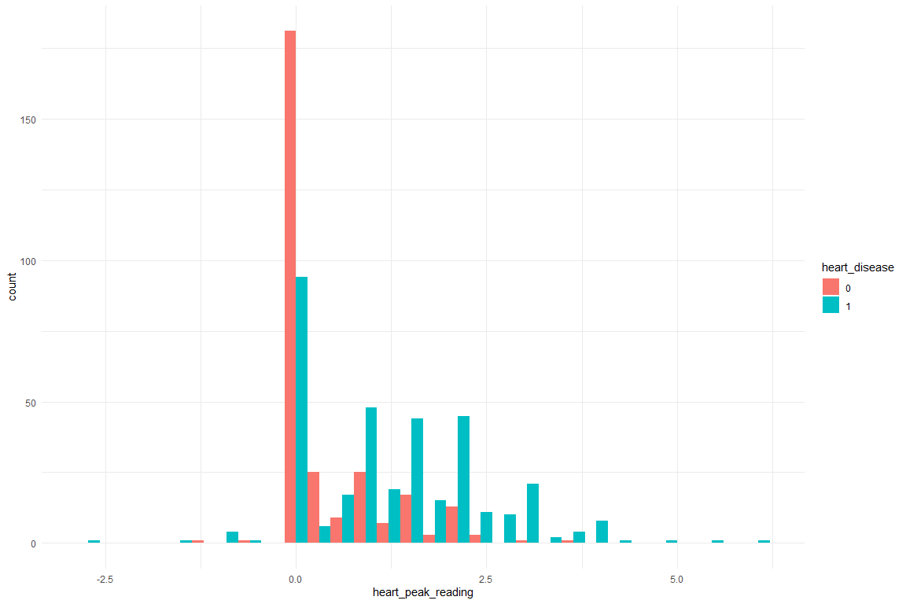

``` r
# cholesterol  
train_df %>%
  ggplot(aes(cholesterol)) +
  geom_histogram()
```

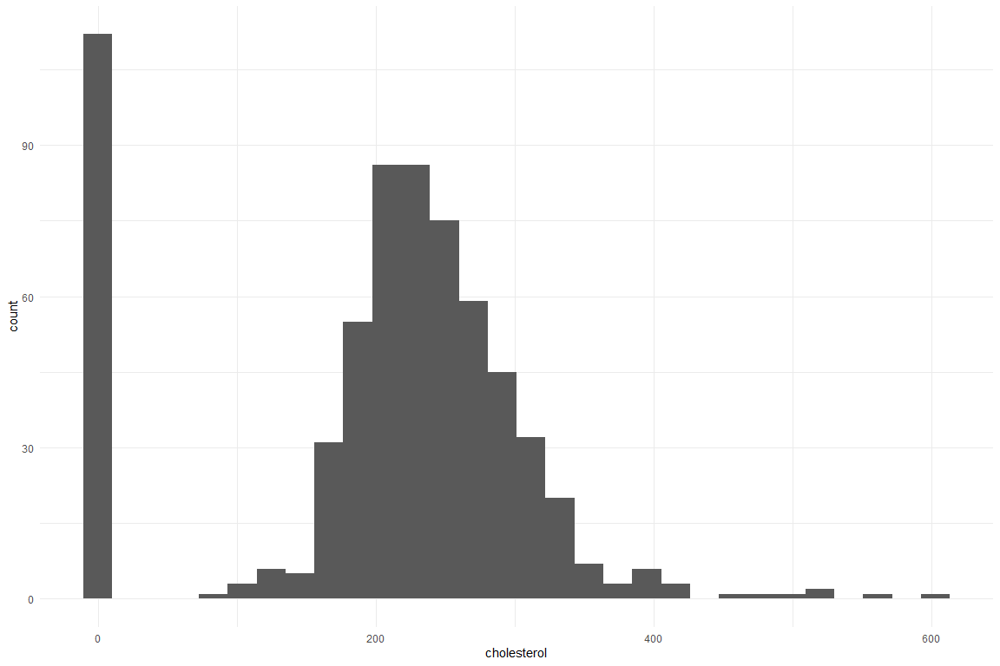

``` r
train_df %>%
  ggplot(aes(cholesterol, fill = heart_disease)) +
  geom_histogram(position = "dodge")
```

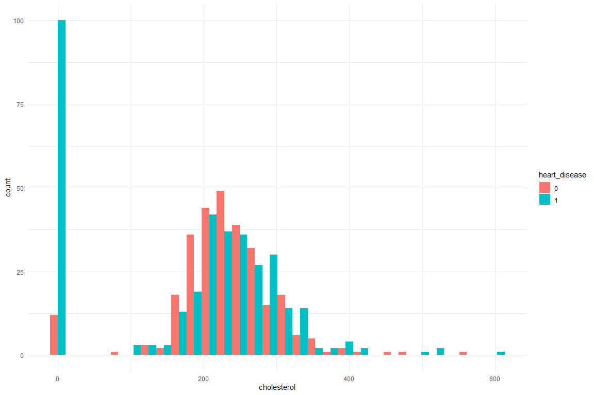

``` r
train_df %>%
  ggplot(aes(cholesterol, max_hr, fill = heart_disease)) +
  geom_point()
```

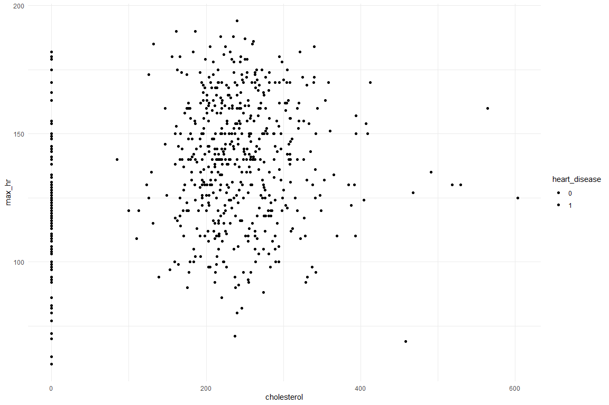

``` r
# angina
train_df %>%
  count(angina)
```

    # A tibble: 2 × 2
      angina     n
      <fct>  <int>
    1 N        384
    2 Y        258

``` r
train_df %>%
  ggplot(aes(angina, fill = heart_disease)) +
  geom_bar(position = "dodge")
```

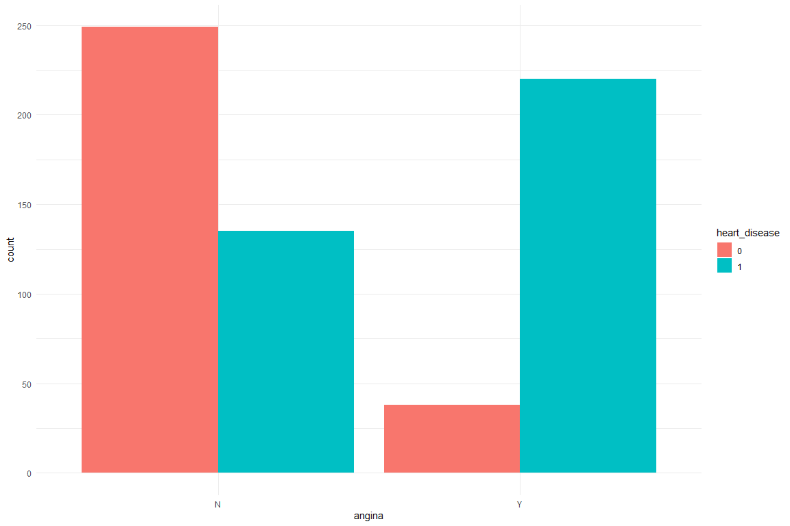

``` r
# fasting bs
train_df %>%
  ggplot(aes(fasting_bs, fill = heart_disease)) +
  geom_bar(position = "dodge")
```

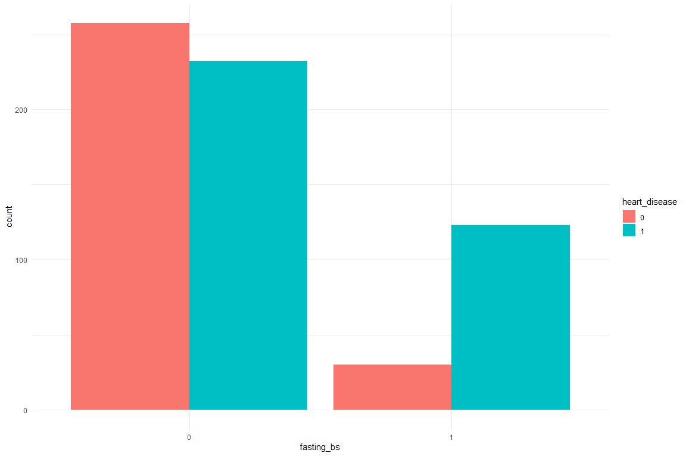

# Logistic Regression

``` r
model_rec <- recipe(heart_disease ~ ., data = train_df) %>%
  step_corr(all_numeric(), threshold = 0.8) %>%
  # 
  step_novel(all_nominal_predictors()) %>%
  # remove no variance predictors
  step_zv(all_predictors()) %>%
  # normalize data so that it is between 0 and 1
  step_normalize(all_numeric_predictors()) %>%
  # standardize data so that is has mean zero and sd one
  step_center(all_numeric_predictors()) %>%
  step_scale(all_numeric_predictors()) %>%
  step_dummy(all_nominal_predictors(), one_hot = TRUE)

model_rec %>%
  prep() %>%
  bake(new_data = NULL)
```

    # A tibble: 642 × 19
           age resting…¹ chole…²  max_hr heart…³ heart…⁴ sex_F sex_M sex_new fasti…⁵
         <dbl>     <dbl>   <dbl>   <dbl>   <dbl> <fct>   <dbl> <dbl>   <dbl>   <dbl>
     1 -1.78      -0.102  0.740  -1.53    -0.804 0           0     1       0       1
     2  0.0574     0.969 -0.0684 -0.579   -0.804 0           0     1       0       1
     3 -1.56      -0.638  1.25    1.32    -0.804 0           0     1       0       1
     4 -0.913     -0.102  0.317   1.32    -0.804 0           1     0       0       1
     5 -0.590     -0.638  0.749  -0.658   -0.804 0           1     0       0       1
     6 -1.78      -0.102  0.0785  0.213   -0.804 0           1     0       0       1
     7 -1.56      -0.638  0.0143  0.332   -0.804 0           0     1       0       1
     8 -1.24      -0.906  0.0785  0.0155  -0.804 0           1     0       0       1
     9  0.0574    -0.638  0.648   0.530    0.578 0           1     0       0       1
    10 -1.13      -0.638 -0.0133  1.12    -0.804 0           1     0       0       1
    # … with 632 more rows, 9 more variables: fasting_bs_X1 <dbl>,
    #   fasting_bs_new <dbl>, resting_ecg_LVH <dbl>, resting_ecg_Normal <dbl>,
    #   resting_ecg_ST <dbl>, resting_ecg_new <dbl>, angina_N <dbl>,
    #   angina_Y <dbl>, angina_new <dbl>, and abbreviated variable names
    #   ¹​resting_bp, ²​cholesterol, ³​heart_peak_reading, ⁴​heart_disease,
    #   ⁵​fasting_bs_X0

``` r
model_train <- model_rec %>%
  prep() %>%
  bake(new_data = NULL)

model_test <- model_rec %>%
  prep() %>%
  bake(new_data = test_df)

log_mod <- 
  logistic_reg() %>%
  set_engine('glm') %>%
  set_mode('classification')

model_wf <-
  workflow() %>%
  add_recipe(model_rec)

eval_metrics <- metric_set(roc_auc, accuracy, sensitivity, specificity)

log_rs <- model_wf %>%
  add_model(log_mod) %>%
  fit_resamples(
    resamples = train_folds,
    metrics = eval_metrics,
    control = control_resamples(save_pred = TRUE)
  )

collect_metrics(log_rs)
```

    # A tibble: 4 × 6
      .metric     .estimator  mean     n std_err .config             
      <chr>       <chr>      <dbl> <int>   <dbl> <chr>               
    1 accuracy    binary     0.810    10 0.0141  Preprocessor1_Model1
    2 roc_auc     binary     0.871    10 0.00496 Preprocessor1_Model1
    3 sensitivity binary     0.784    10 0.0236  Preprocessor1_Model1
    4 specificity binary     0.831    10 0.0235  Preprocessor1_Model1

``` r
log_rs %>%
  conf_mat_resampled()
```

    # A tibble: 4 × 3
      Prediction Truth  Freq
      <fct>      <fct> <dbl>
    1 0          0      22.5
    2 0          1       6  
    3 1          0       6.2
    4 1          1      29.5

``` r
log_rs %>%
  collect_predictions() %>%
  group_by(id) %>%
  roc_curve(heart_disease, .pred_1) %>%
  ggplot(aes(1 - specificity, sensitivity, color = id)) +
  geom_abline(lty = 2, color = "gray80", size = 1.5) +
  geom_path(show.legend = FALSE, alpha = 0.6, size = 1.2) +
  coord_equal()
```

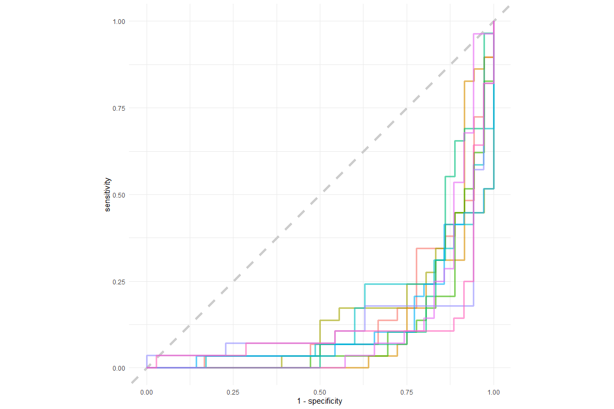

# Random Forest

``` r
rf_mod <- 
  rand_forest(trees = 1000) %>%
  set_mode("classification") %>%
  set_engine("ranger")

rf_mod
```

    Random Forest Model Specification (classification)

    Main Arguments:
      trees = 1000

    Computational engine: ranger 

``` r
rf_rs <- model_wf %>%
  add_model(rf_mod) %>%
  fit_resamples(
    resamples = train_folds,
    metrics = eval_metrics,
    control = control_resamples(save_pred = TRUE)
  )

collect_metrics(rf_rs)
```

    # A tibble: 4 × 6
      .metric     .estimator  mean     n std_err .config             
      <chr>       <chr>      <dbl> <int>   <dbl> <chr>               
    1 accuracy    binary     0.813    10 0.0119  Preprocessor1_Model1
    2 roc_auc     binary     0.883    10 0.00584 Preprocessor1_Model1
    3 sensitivity binary     0.769    10 0.0249  Preprocessor1_Model1
    4 specificity binary     0.848    10 0.0215  Preprocessor1_Model1

``` r
rf_rs %>%
  conf_mat_resampled()
```

    # A tibble: 4 × 3
      Prediction Truth  Freq
      <fct>      <fct> <dbl>
    1 0          0      22.1
    2 0          1       5.4
    3 1          0       6.6
    4 1          1      30.1

``` r
rf_rs %>%
  collect_predictions() %>%
  group_by(id) %>%
  roc_curve(heart_disease, .pred_1) %>%
  ggplot(aes(1 - specificity, sensitivity, color = id)) +
  geom_abline(lty = 2, color = "gray80", size = 1.5) +
  geom_path(show.legend = FALSE, alpha = 0.6, size = 1.2) +
  coord_equal()
```

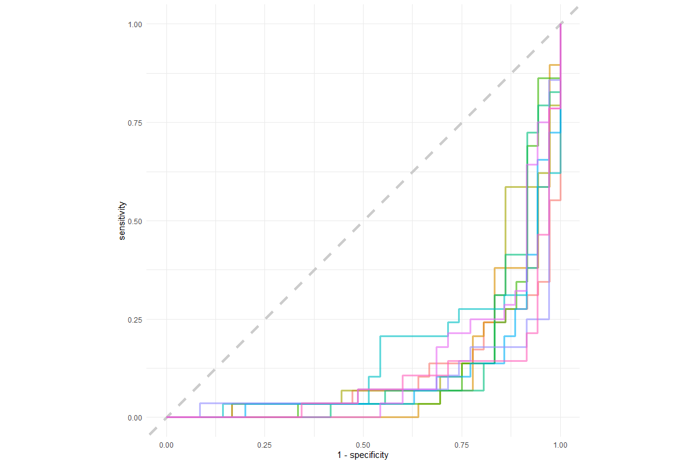

# XGBoost

``` r
xgb_mod <- 
  boost_tree(
    trees = tune(),
    tree_depth = tune(),
    learn_rate = tune(),
    min_n = tune(),
    loss_reduction = tune(),
    stop_iter = tune()
    ) %>%
  set_mode("classification") %>%
  set_engine("xgboost")

search_res <-
  model_wf %>%
  add_model(xgb_mod) %>%
  tune_bayes(
    resamples = train_folds,
    # To use non-default parameter ranges
    # param_info = svm_set,
    # Generate five at semi-random to start
    initial = 10,
    iter = 30,
    # How to measure performance?
    metrics = eval_metrics,
    control = control_bayes(no_improve = 10, verbose = TRUE)
  )

show_best(search_res, metric = "accuracy")
```

    # A tibble: 5 × 13
      trees min_n tree_depth learn_rate loss_r…¹ stop_…² .metric .esti…³  mean     n
      <int> <int>      <int>      <dbl>    <dbl>   <int> <chr>   <chr>   <dbl> <int>
    1  1851    14          1    0.120    3.88e-1      15 accura… binary  0.819    10
    2   580    19          2    0.0208   1.03e-5      15 accura… binary  0.816    10
    3  1596    14         15    0.00358  3.76e-4      11 accura… binary  0.815    10
    4   283    14          8    0.0143   2.26e+0       3 accura… binary  0.815    10
    5  1283    14         10    0.00255  1.93e-2      20 accura… binary  0.812    10
    # … with 3 more variables: std_err <dbl>, .config <chr>, .iter <int>, and
    #   abbreviated variable names ¹​loss_reduction, ²​stop_iter, ³​.estimator

``` r
autoplot(search_res, type = "performance")
```

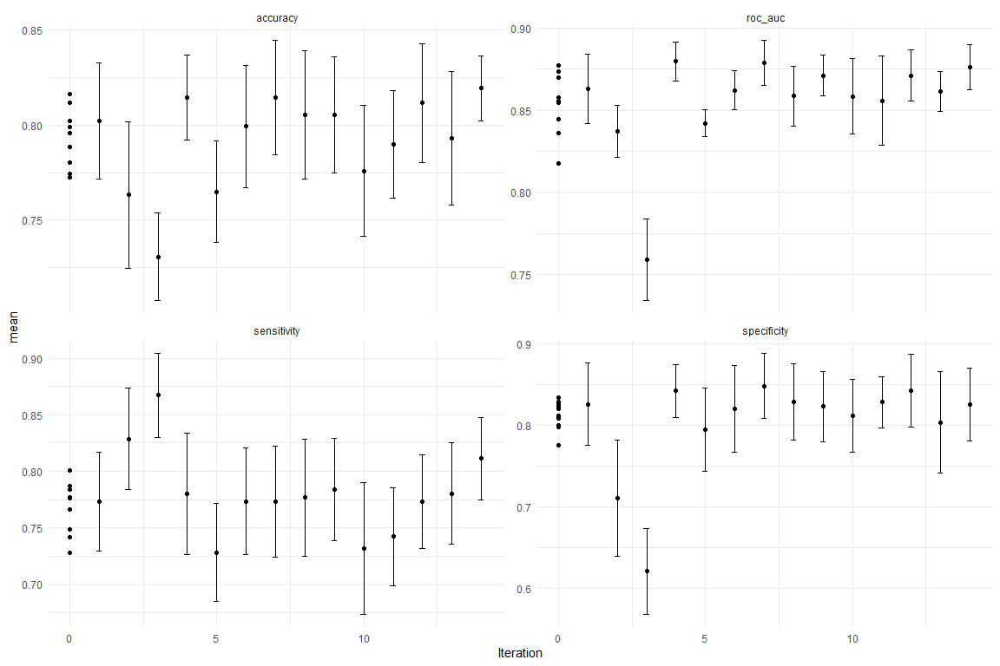

``` r
best_xgb <- search_res %>%
  select_best("accuracy")
  
xgb_rs <- model_wf %>%
  add_model(xgb_mod) %>%
  finalize_workflow(best_xgb) %>%
  fit_resamples(
    resamples = train_folds,
    metrics = eval_metrics,
    control = control_resamples(save_pred = TRUE)
  )

collect_metrics(xgb_rs)
```

    # A tibble: 4 × 6
      .metric     .estimator  mean     n std_err .config             
      <chr>       <chr>      <dbl> <int>   <dbl> <chr>               
    1 accuracy    binary     0.819    10 0.00772 Preprocessor1_Model1
    2 roc_auc     binary     0.876    10 0.00613 Preprocessor1_Model1
    3 sensitivity binary     0.811    10 0.0164  Preprocessor1_Model1
    4 specificity binary     0.825    10 0.0200  Preprocessor1_Model1

``` r
final_mod <- model_wf %>%
  add_model(xgb_mod) %>%
  finalize_workflow(best_xgb) %>%
  last_fit(train_test_split)

final_mod
```

    # Resampling results
    # Manual resampling 
    # A tibble: 1 × 6
      splits            id               .metrics .notes   .predictions .workflow 
      <list>            <chr>            <list>   <list>   <list>       <list>    
    1 <split [642/276]> train/test split <tibble> <tibble> <tibble>     <workflow>

``` r
collect_metrics(final_mod)
```

    # A tibble: 2 × 4
      .metric  .estimator .estimate .config             
      <chr>    <chr>          <dbl> <chr>               
    1 accuracy binary         0.808 Preprocessor1_Model1
    2 roc_auc  binary         0.884 Preprocessor1_Model1

``` r
collect_predictions(final_mod) %>%
  conf_mat(heart_disease, .pred_class)
```

              Truth
    Prediction   0   1
             0  95  25
             1  28 128
